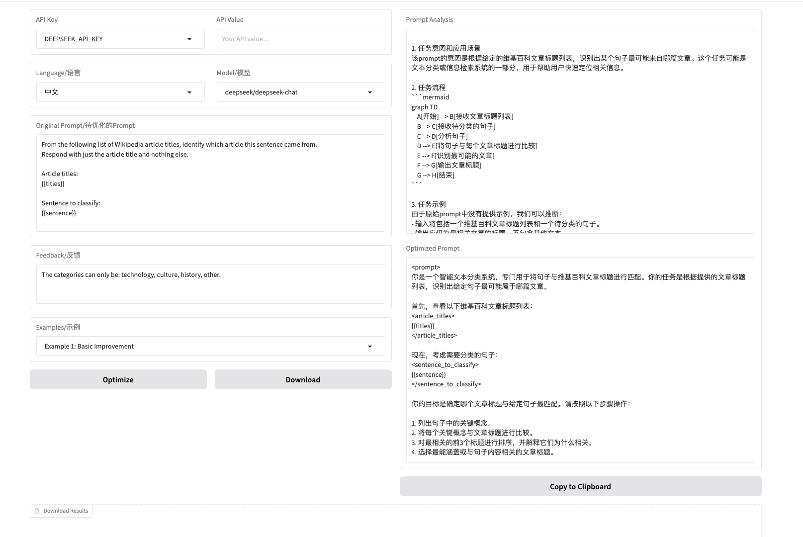

[中文](./README_ZH.md) ｜ English

<br>
<a href="https://huggingface.co/spaces/jt120lz/open-improve-prompt">Demo</a>

# Introduction

The open-source version of Anthropic's improved prompt can be used with different models.



## Features

- Support for multiple languages (Chinese and English)
- Multiple LLM model options (DeepSeek, Claude 3.5 Sonnet, GPT-4o)
- Download results in JSON format

## Installation

This project requires Python 3.11. It is recommended to use a dedicated virtual environment:

```bash
# Create a virtual environment
python3.11 -m venv venv

# Activate the virtual environment
# On macOS/Linux:
source venv/bin/activate
# On Windows:
# .\venv\Scripts\activate

# Install dependencies
pip install -r requirements.txt
```

## Usage

Run the application:

```bash
python app.py
```

The interface will be available at http://localhost:7860 by default.

## References

- [anthropic](https://docs.anthropic.com/en/docs/build-with-claude/prompt-engineering/prompt-improver)
- [generate](https://github.com/wangyuxinwhy/generate)
